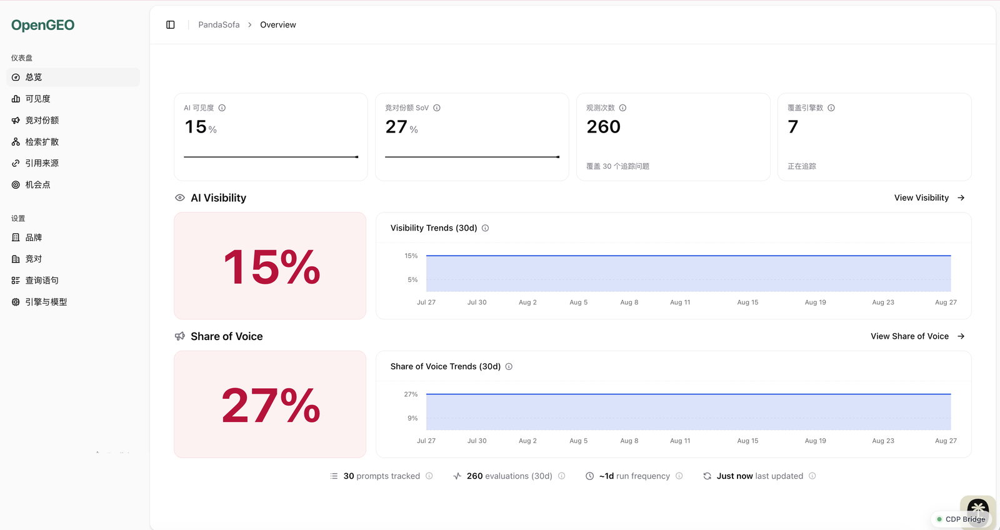
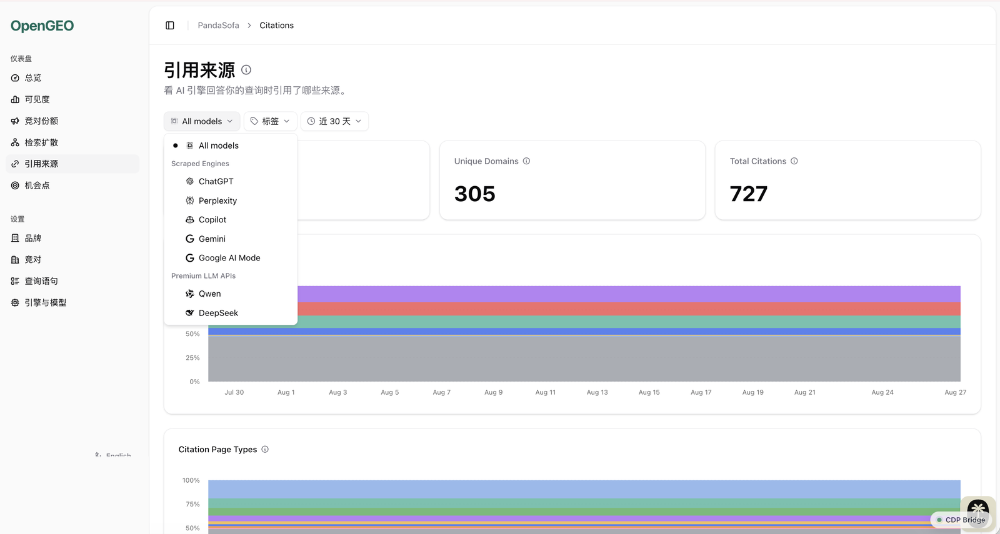
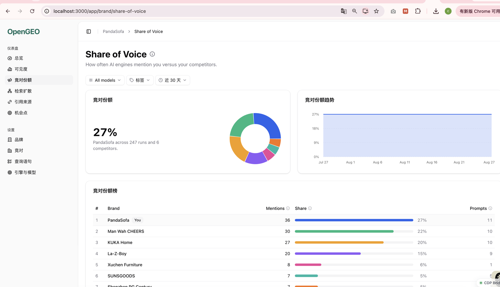
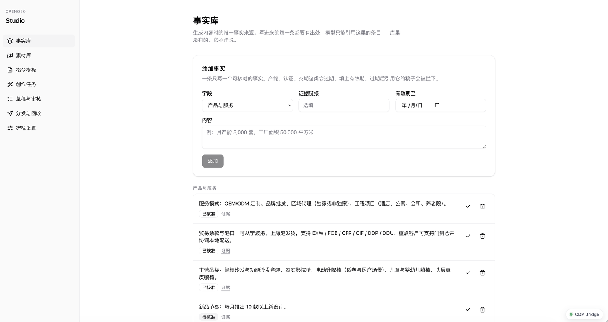
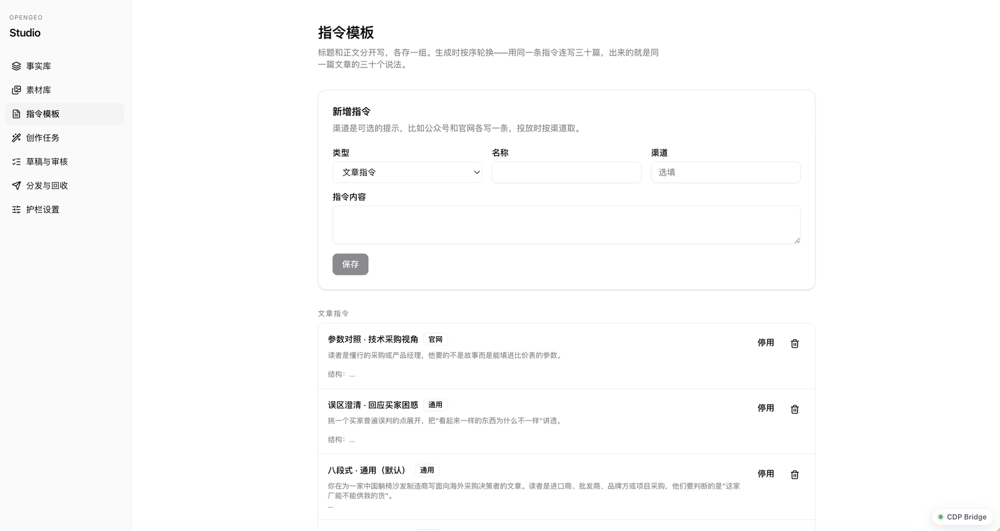
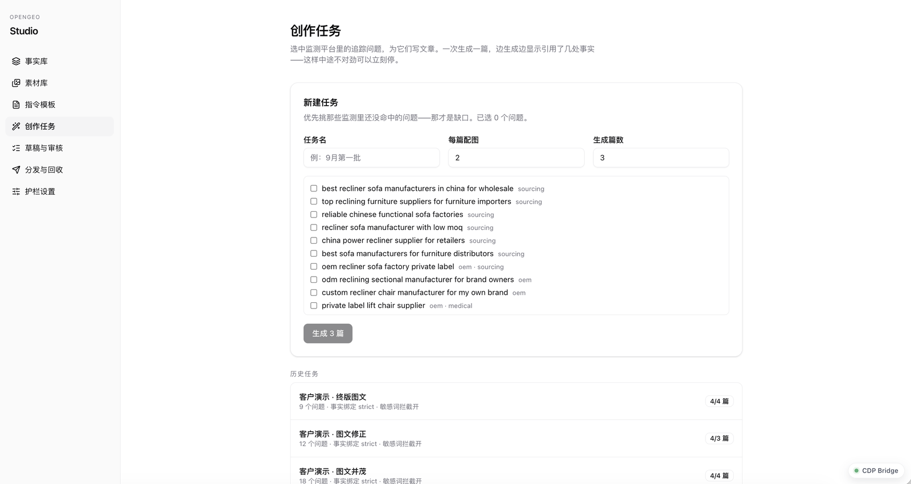

<p align="center">
  
</p>

<h1 align="center">OpenGEO Platform</h1>

<p align="center">
  开源的 AI 可见度监测与优化平台 · 中外答案引擎同列一等公民
  <br />
  Open-source AI visibility tracking and optimization, with Chinese answer engines as first-class citizens.
</p>

<p align="center">
  <a href="https://github.com/cangqiaoGEO"></a>&nbsp;
  <a href="LICENSE.md"></a>&nbsp;
  <a href="https://github.com/cangqiaoGEO/opengeo-platform/issues"></a>
</p>

<br />

## 这是什么

OpenGEO Platform 追踪 AI 答案引擎——ChatGPT、Perplexity、Gemini、Copilot、Google AI 模式与 AI 概览，以及国内的豆包、通义千问、DeepSeek、腾讯元宝——如何提及、引用和描述你的品牌，让你能对标竞对并把可见度做上去。

这件事在不同语境下有不同叫法：答案引擎优化（AEO）、生成式引擎优化（GEO）、大模型优化（LLMO）。

它同时是两件东西：

- **监测台**（`apps/web`）：按周期跑追踪问题、记录每一次真实问答、算可见度与竞对份额、拆解引用来源
- **内容工作台 OpenGEO Studio**（`apps/studio`）：依据监测结果生产内容——品牌事实库、素材库、指令模板、生成、审核、分发，并把发布出去的 URL 回传给监测侧验证是否真被引擎读到

监测回答"我现在在哪"，Studio 回答"那接下来写什么"。两者共用一套登录、一个数据库、一套组件库。

## 截图

**监测台** —— 可见度、竞对份额、引用来源

| | |
|---|---|
|  |  |
| 总览：可见度、SoV、观测次数与覆盖引擎数 | 引用来源：305 个域名、727 条引用，可按引擎与时间筛选 |
|  |  |
| 竞对份额：与每个竞对的提及率对比 | Studio 事实库：生成内容唯一的事实来源，每条带出处 |

**Studio** —— 从事实库到成稿

| | |
|---|---|
|  |  |
| 指令模板：标题与正文分开，生成时轮换 | 创作任务：挑监测里没命中的问题，那才是缺口 |
|  | |
| 草稿：配图按 id 从素材库选取，正文引用带脚注 | |

## 与上游的关系

本仓库是 [elmohq/elmo](https://github.com/elmohq/elmo)（MIT, Copyright © 2026 Blue Whale Software, LLC）的分叉，采用 **fork-and-diverge** 策略：锁定分叉点自主演进，不承诺跟随上游功能，`upstream` remote 保留用于按需 cherry-pick 修复。上游 LICENSE 与版权声明按 MIT 要求完整保留。

分叉后新增的部分记录在 [OPENGEO.md](OPENGEO.md)。

## 监测台追踪什么

- **可见度评分** —— 每条追踪问题在每个引擎上的品牌提及率，按问题、按引擎、按时间成趋势
- **品牌提及识别** —— 按品牌名、别名与自有域名统一口径匹配，跨引擎一致
- **引用来源分析** —— 引擎引用的每一个 URL 连同域名与位置一并存下并归类：自有域、竞对域、社交媒体、Google 属性、机构来源。你能看到 AI 在你这个行业里到底信任哪些页面
- **竞对份额 SoV** —— `品牌提及数 ÷（品牌提及数 + 竞对提及总数）`，分母为零时不计分而非折算为 0
- **检索扩散** —— 引擎在生成答案前跑了哪些网页搜索、如何改写你的措辞、哪些检索你赢了哪些没有
- **问题管理** —— onboarding 分析官网后给出品牌名、别名、竞对与追踪问题建议；也可手工录入、打标签、单独启停
- **机会点** —— 把可见度与引用数据转成一份会定期刷新的优先级清单
- **报告** —— 可分享的可见度报告，利益相关方无需账号即可查看
- **REST API** —— 品牌、问题、竞对的增删改查，以及分析快照与报告的程序化获取

## Studio 生产什么

- **品牌事实库** —— 生成内容时唯一的事实来源。每条事实带出处链接与有效期；模型只能引用库里的条目，引用按条目 id 校验而不是靠模型自称
- **素材库** —— 从官网抓取图片、视频与文案，按来源页分类。图片按链接引用，视频落到本地（各渠道要上传文件而不是贴链接）
- **指令模板** —— 标题与正文分开存、按序轮换，避免一批稿子读起来是同一篇文章的 N 个说法
- **创作任务** —— 选中监测里未命中的问题批量生成，边生成边显示引用了几处事实
- **草稿与审核** —— 无事实支撑的说法会被拦下；通过一篇被拦下的稿子必须写明理由，并记录为越权批准而非普通通过
- **护栏设置** —— 人工审核、绝对化用语拦截、事实绑定强度均为组织级开关，每次改动记入只增不改的审计表
- **分发与回收** —— 导出发布包、登记发布地址，并与监测侧真实抓到的引用比对

## 可见度是怎么算出来的

方法论在这个仓库里可以逐行读：

1. **追踪问题按品牌定义** —— 由 onboarding 从官网生成，或手工写。每条都是潜在客户可能问 AI 的问题
2. **后台 worker 按周期跑每条问题**，覆盖你配置的每个引擎。采集通道拿的是真实消费者界面；模型 API 通道补充覆盖面。两种口径的差别与成本在 `packages/docs` 里讲清楚了
3. **每次回答都被归一化解析** —— 存下答案正文、被引用的 URL 列表、引擎跑过的检索词、模型版本，并按品牌与各竞对的名称/别名/域名扫描提及
4. **全部落进 PostgreSQL**，包括引擎原始输出，所以任何指标事后都能重算与复核
5. **聚合成趋势** —— 可见度是提及运行数占比；SoV 对比你与竞对的提及率；引用按 URL、域名、类别汇总，均可按问题、标签、引擎与时间筛选

开源意味着这一整套循环不需要你选择相信。AEO 工具的价值取决于测量质量，而这里的测量你可以读、可以跑、可以验。

## 中文引擎

上游只覆盖国际引擎。本分叉把国内四家答案引擎接成一等公民，走各自的官方 API 通道：

| 引擎 | 通道 | 凭证 |
|---|---|---|
| 豆包 | 火山方舟 Responses + web_search | `ARK_API_KEY` |
| 通义千问 | DashScope 强制联网 + 结构化引用 | `DASHSCOPE_API_KEY` |
| DeepSeek | DeepSeek 官方 API | `DEEPSEEK_API_KEY` |
| 腾讯元宝 | TokenHub + 联网检索 | `TENCENT_TOKENHUB_API_KEY` |

## 模型网关

阿里云百炼不是答案引擎，是一个 OpenAI 兼容的模型网关——一个 key 后面挂着 Qwen、DeepSeek、GLM 三家的模型。它在这里承担两件事：

- **onboarding 的结构化研究** —— 它支持 `json_schema` 结构化输出，这是品牌分析唯一的硬需求
- **Studio 的内容生成** —— 成本远低于按引擎采集

凭证是 `BAILIAN_API_KEY`，base URL 可用 `BAILIAN_BASE_URL` 覆盖。

一个必须知道的边界：**百炼不返回引用 URL。**联网检索确实会发生（它能答出只有实时检索才知道的信息），但响应体里没有 `search_info` / `annotations` / `sources` 任何一个字段。所以这条通道的 citations 返回空数组而不是编造——用它跑追踪时，可见度与竞对份额有数据，引用来源与检索扩散会是空的。要那两块数据，得走消费者界面采集通道。

## 快速开始

需要 Node.js 24、pnpm 与 PostgreSQL。

```bash
pnpm install

# 建库并写入配置（两个随机密钥）
createdb opengeo_platform
cp .env.example .env && cp .env apps/web/.env

# 执行迁移
(cd packages/lib && pnpm exec drizzle-kit migrate)

# 起服务
pnpm --filter @workspace/web dev      # 监测台 http://localhost:3000
pnpm --filter @workspace/worker dev   # 后台任务
pnpm --filter @workspace/studio-app dev  # Studio http://localhost:3002
```

`.env.example` 里 `SCRAPE_TARGETS=stub:stub` 是零成本跑通全流程用的。换真实引擎时按注释块填对应 Key 并替换目标串——中文四引擎走官方 API；国际消费者界面二选一（Cloro 覆盖最全，或 BrightData 按量计费）。

Docker Compose 部署见 `docker/` 与 `apps/cli`。

## 部署模式

| 模式 | 说明 |
|---|---|
| `local` | 单机自托管，全部功能，无计费 |
| `whitelabel` | 自定义品牌与域名，面向代运营多品牌场景 |

模式由 `DEPLOYMENT_MODE` 决定，各模式开放的能力在 `packages/deployment` 里声明。

## 架构

监测台服务仪表盘与 REST API，worker 调度并执行问题运行，PostgreSQL 同时承担数据存储与任务队列。Studio 是同仓的第二个应用，共用登录、数据库与组件库，但**只新增文件、不修改上游维护的文件**——这条边界规则与它的 CI 检查写在 [AGENTS.md](AGENTS.md) 里，是这个分叉还能继续 cherry-pick 上游修复的前提。

```
apps/web       监测台（TanStack Start）
apps/studio    内容工作台（TanStack Start）
apps/worker    pg-boss 后台任务
apps/www       上游营销站（保留未改）
apps/cli       Docker Compose 部署 CLI
packages/lib   共享逻辑与 Drizzle schema
packages/studio  Studio 自己的 schema 与独立迁移链
packages/ui    共享组件
packages/config  环境变量校验与常量
```

## 技术栈

- [TypeScript](https://www.typescriptlang.org/) · [TanStack Start](https://tanstack.com/start/latest) · [Vite](https://vite.dev/)
- [PostgreSQL](https://www.postgresql.org/) · [Drizzle ORM](https://orm.drizzle.team/) · [pg-boss](https://github.com/timgit/pg-boss)
- [Tailwind CSS](https://tailwindcss.com/) · [Base UI](https://base-ui.com/)
- [Docker Compose](https://docs.docker.com/compose/)

## 文档

- [OPENGEO.md](OPENGEO.md) —— 分叉声明、中文引擎接入与路线图
- [AGENTS.md](AGENTS.md) —— 仓库约定、Studio 边界规则
- `packages/docs` —— 用户与开发者文档正文（由 `apps/www` 渲染）

## 相关仓库

标准与工具层在 [cangqiaoGEO](https://github.com/cangqiaoGEO) 组织：spec / audit / insights / skills / agentready / index 六层。

## 许可

MIT，见 [LICENSE.md](LICENSE.md)。上游 elmo 的版权声明完整保留。
